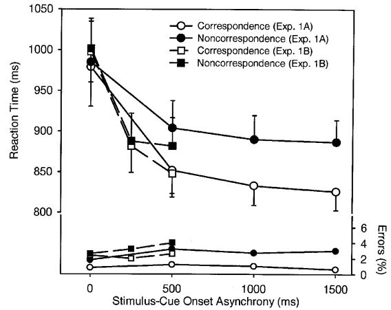

## Outline
1. Background: How psychologistis study *Cognitive Conflict*
2. Understand Hommel (2002)
3. Exact replication of Hommel's experiment 1.

# Background: How psychologistis study *Cognitive Conflict*

## Cogintive Conflict
- Awareness of the beliefs, decisions, or behaviors that contradticted with each other.  
- A sincere Muslim is not a terrorist.  
- A student got F after he had studied over night before the final exam (Cognitive dissonance; Cooper & Fazio, 1984).  
- We have to name the color "blue" to the word "red" presented in "blue" (Stroop Effect). 
- Summary: [Developed tasks to measure cognitive conflict](http://dimensional-overlap.com/)

## Stimulus-Response Compatibility
  
- Started from Simon and Rudell (1967); Simon(1969).  
- The dimensions of sitmulus are irrelavent to the response set.  
- Compatible responeses are faster than the incompatible responses.  

# Understand Hommel (2002)

## Time course of compatibility
- Experiment 1 of Hommel (2002)  
- At which _SOA_ the space-response compatibility could cause Simon effect.  
  

## Original Method
- SOA: A~ 0 ms, 500 ms, 1000 ms, 1500 ms; B~ 0 ms, 250 ms, 500 ms  
- Correspondence: Target at corresponding/noncorresponding location.  
- Participants: A~ 8 adults; B~ 12 adults.  
- Check the Opensesame script.  

## Original Resluts


## Original Effect Sizes and Powers, Part A
```{r Part_A, cache=TRUE, echo = FALSE, warning=FALSE, message=FALSE}
source("functions.r")
require(pwr)
# Main effect of SOA:  F(3, 21) = 12.81.
paste("ES of SOA =",esComp(12.81, 3, 21, 8, "F") )
paste("Power of SOA =",pwr.anova.test(f=esComp(12.81, 3, 21, 8, "F"), k=2,n=8)$power)
# Main effect of Correspondence: F(1, 7) = 12.04. 
paste("ES of Correspondence =",esComp(12.04, 1, 7, 8, "F"))
paste("Power of Correspondence =",pwr.anova.test(f=esComp(12.04, 1, 7, 8, "F"), k=2,n=8)$power)
# Interaction of SOA and Correspondence: F(3, 21) = 5.50. 
paste("ES of Interaction =",esComp(5.50, 3, 21, 8, "F"))
paste("Power of Interaction  =",pwr.anova.test(f=esComp(5.50, 3, 21, 8, "F"), k=2,n=8)$power)
```

## Evluate the power of correspondence (part A) by sample size
```{r power_A, cache=TRUE, echo = FALSE, warning=FALSE, message=FALSE}
n <- seq(5, 20) # Expected number of participants in replication study
power <- pwr.anova.test(f=esComp(12.04, 1, 7, 8, "F"), k=2,n=n)$power
plot(n, power)
```

## Original Effect Sizes and Powers, Part B
```{r part B, cache=TRUE, echo = FALSE, warning=FALSE, message=FALSE}
source("functions.r")
require(pwr)
# Main effect of SOA:  F(2, 22) = 69.84. 
paste("ES of SOA =",esComp(69.84, 2, 22, 12, "F") )
paste("Power of SOA =",pwr.anova.test(f=esComp(69.84, 2, 22, 12, "F"), k=2,n=12)$power)
# Main effect of correspondence: *F(1, 11)* = 11.05.
paste("ES of Correspondence =",esComp(11.05, 1, 11, 12, "F") )
paste("Power of Correspondence =",pwr.anova.test(f=esComp(11.05, 1, 11, 12, "F"), k=2,n=12)$power)
# Interaction of SOA and Correspondence: *F(2, 22)* = 3.93.   
paste("ES of Interaction =",esComp(3.93, 2, 22, 12, "F") )
paste("Power of Interaction =",pwr.anova.test(f=esComp(3.93, 2, 22, 12, "F"), k=2,n=12)$power)
```

## Evluate the power of correspondence (part B) by sample size
```{r power_B, cache=TRUE, echo = FALSE, warning=FALSE, message=FALSE}
n <- seq(5, 20) # Expected number of participants in replication study
power <- pwr.anova.test(f=esComp(11.05, 1, 11, 12, "F"), k=2,n=n)$power
plot(n, power)
```

# Exact replication of Hommel's experiment 1

## How to reproduce the experiment
- Execute and check *EXP1A_Draft01.osexp*.
- Check the output file *quickrun.csv*.
- Where are the IVs and DVs (RT, accuracy)?

## Build the executable script
- Complete *EXP1_V01.osexp*.
- How to write the proposal of exact replication?

